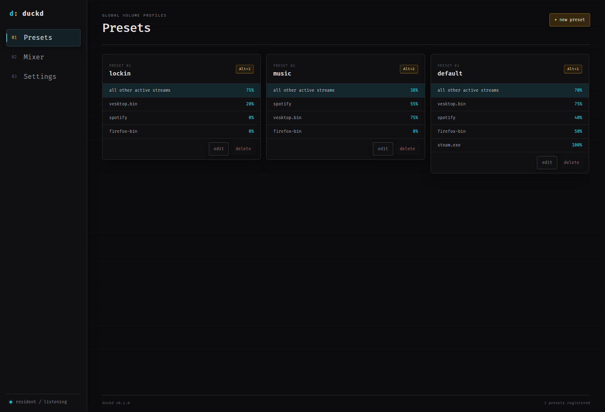

<div align="center">

# [duckd](https://duckd.ai9an.com)

duckd is a lightweight desktop audio manager. it provides global hotkey volume presets, a per-application mixer, and lives in your tray. 



</div>

## features

- global hotkeys for volume presets, including while the main window is hidden
- per-application volume mixer for currently active audio streams
- optional default volume for every stream not explicitly listed in a preset
- system tray controls and close-to-tray behaviour
- editable, human-readable .toml configuration
- config import and export

## download

download the latest release from the [website](https://duckd.ai9an.com) or from the [releases](https://github.com/ai9an/duckd/releases/) page.

## local install

```bash
git clone https://github.com/ai9an/duckd.git
cd duckd
```

install node.js, rust, and the [tauri v2 prerequisites](https://v2.tauri.app/start/prerequisites/), then run:

```sh
npm install
npm run tauri dev
```

create a linux appImage:

```sh
npm run bundle:linux
```

create MSI and NSIS installers for windows:

```powershell
npm run bundle:windows
```

## presets

1. open **presets** and select **new preset**.
2. give the preset a name and record a global hotkey.
3. choose running applications and set their target volumes.
4. optionally set a default volume for all other active streams.
5. save the preset and use its shortcut from any application.

applications are matched by process or executable name. a preset silently skips applications that are not currently running, and explicitly listed targets override its default stream volume.

> per-application microphone volume is not exposed and therefor cannot be used on windows

## configuration

duckd uses .toml for a readable config system.

```text
[general]
run_in_tray = true
hud_hotkey = "Ctrl+Shift+Space"

[[presets]]
name = "lockin"
hotkey = "Alt+3"
default_volume = 75

[[presets.targets]]
app = "vesktop.bin"
volume = 20

[[presets.targets]]
app = "spotify"
volume = 0

[[presets.targets]]
app = "firefox-bin"
volume = 0
```
## desktop app built with

- [`tauri v2`](https://tauri.app/)
- `rust`
- `vanilla typeScript and vite`
- `windows-volume-control` on windows
- `pulsectl` on linux

